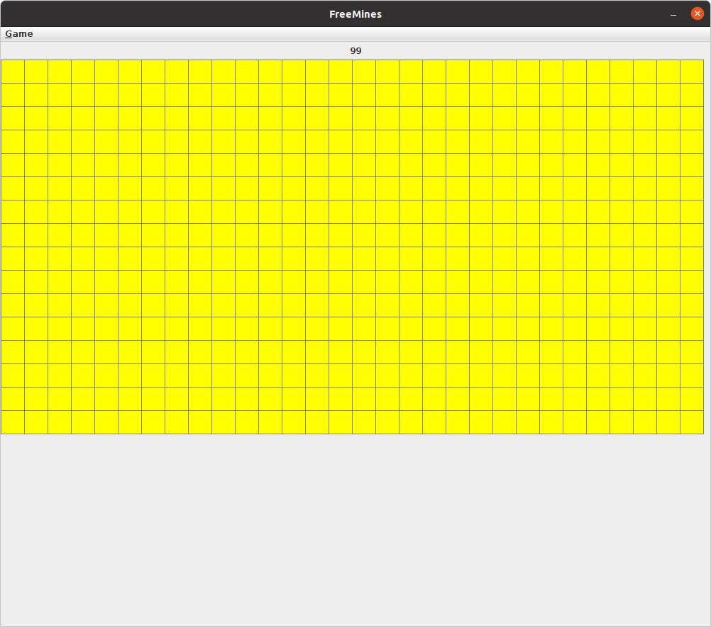
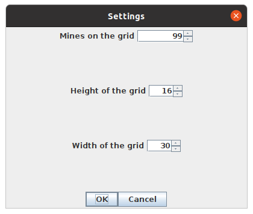

# FreeMines

FreeMines is an implementation of the game [Minesweeper](https://en.wikipedia.org/wiki/Minesweeper_(video_game)).
It is fully developped in Java and the GUI was created with the Swing library.

## Usage

Clone this repository and use the Gradle Wrapper to run the software.
Only java (17) is needed.

```bash
./gradlew run
```

You should see this screen:



Click any cell, the first one is guaranteed to be mine free, as its
surroundings. A timer is triggered and the number of unflagged mines is
displayed above the grid. If you reveal a mine or complete the grid, the timer
is stopped and a dialog shows up, displaying the game time in seconds, with a
message that indicates if you won or not.

To change the dimensions and the number of mines of the grid, or to restart,
you can either press Ctrl-N or go to Game > New and modify the parameters as you
wish.



## Controls

- To reveal a cell, press the left mouse button
- To flag a cell, press the right mouse button

You can also drag the mouse while pressing the left mouse button to reveal
cells.

## Contribution

You can contribute to this project if you want, pick an issue and publish your
pull request. The next main feature is the ability to replay a game of
minesweeper at real speed.
